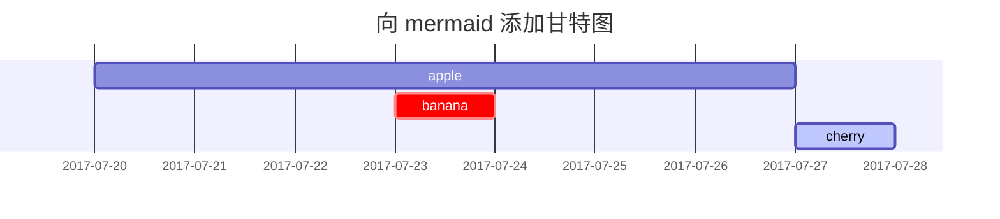

这篇文章是为了展示 [**Chirpy**](https://github.com/cotes2020/jekyll-theme-chirpy/) 上的 Markdown 语法渲染，你也可以用它作为写作的例子。现在，让我们开始查看文本和排版。

## 标题
---
# H1 - 标题

<h2 data-toc-skip>H2 - 标题</h2>

<h3 data-toc-skip>H3 - 标题</h3>

<h4>H4 - 标题</h4>
---

## 段落

余幼时即嗜学。家贫，无从致书以观，每假借于藏书之家，手自笔录，计日以还。天大寒，砚冰坚，手指不可屈伸，弗之怠。录毕，走送之，不敢稍逾约。以是人多以书假余，余因得遍观群书。既加冠，益慕圣贤之道 ，又患无硕师、名人与游，尝趋百里外，从乡之先达执经叩问。先达德隆望尊，门人弟子填其室，未尝稍降辞色。余立侍左右，援疑质理，俯身倾耳以请；或遇其叱咄，色愈恭，礼愈至，不敢出一言以复；俟其欣悦，则又请焉。故余虽愚，卒获有所闻。
当余之从师也，负箧曳屣行深山巨谷中，穷冬烈风，大雪深数尺，足肤皲裂而不知。至舍，四支僵劲不能动，媵人持汤沃灌，以衾拥覆，久而乃和。寓逆旅，主人日再食，无鲜肥滋味之享。同舍生皆被绮绣，戴朱缨宝饰之帽，腰白玉之环，左佩刀，右备容臭，烨然若神人；余则缊袍敝衣处其间，略无慕艳意。以中有足乐者，不知口体之奉不若人也。盖余之勤且艰若此。今虽耄老，未有所成，犹幸预君子之列，而承天子之宠光，缀公卿之后，日侍坐备顾问，四海亦谬称其氏名，况才之过于余者乎？<br>今诸生学于太学，县官日有廪稍之供，父母岁有裘葛之遗，无冻馁之患矣；坐大厦之下而诵诗书，无奔走之劳矣；有司业、博士为之师，未有问而不告，求而不得者也；凡所宜有之书，皆集于此，不必若余之手录，假诸人而后见也。其业有不精，德有不成者，非天质之卑，则心不若余之专耳，岂他人之过哉！
东阳马生君则，在太学已二年，流辈甚称其贤。余朝京师，生以乡人子谒余，撰长书以为贽，辞甚畅达，与之论辨，言和而色夷。自谓少时用心于学甚劳，是可谓善学者矣！其将归见其亲也，余故道为学之难以告之。谓余勉乡人以学者，余之志也；诋我夸际遇之盛而骄乡人者，岂知予者哉？

## 列表

### 有序列表

1. 第一个
2. 第二个
3. 第三个

### 无序列表

- 章
  + 小节
    * 段落

### 待办列表

- [ ] 工作项
  + [x] 步骤 1
  + [x] 步骤 2
  + [ ] 步骤 3

### 描述列表

太阳
: 地球环绕的恒星

月亮
: 地球的天然卫星，通过太阳反射光可见

## 引用块

> 此行显示 _引用块_ 。

## 提示

> 显示 `tip` 类型提示的例子。
{: .prompt-tip }

> 显示 `info` 类型提示的例子。
{: .prompt-info }

> 显示 `warning` 类型提示的例子。
{: .prompt-warning }

> 显示 `danger` 类型提示的例子。
{: .prompt-danger }

## 表格

| 公司                         | 联系人            | 国家     |
|:-----------------------------|:-----------------|--------:|
| 阿尔弗雷德                    | 玛丽亚·安德斯      | 德国    |
| 岛屿贸易                      | 海伦·贝内特        | 英国    |
| 意大利食品杂志                 | 乔瓦尼·罗韦利      | 意大利  |

## 链接

<http://127.0.0.1:4000>

## 脚注

点击角标将会定位到脚注[^footnote]，这是另一个脚注[^fn-nth-2]。

## 内联代码

这是 `Inline Code` 的示例。

## 文件路径

就像这样 `/path/to/the/file.extend`{: .filepath} 。

## 代码块

### 常规

```
This is a common code snippet, without syntax highlight and line number.
```

### 指定语言

```bash
if [ $? -ne 0 ]; then
  echo "The command was not successful.";
  #do the needful / exit
fi;
```

### 指定文件名

```sass
@import
  "colors/light-typography",
  "colors/dark-typography"
```
{: file='_sass/jekyll-theme-chirpy.scss'}

## 数学

数学能力由 [**MathJax**](https://www.mathjax.org/) 提供支持：

$$ \sum_{n=1}^\infty 1/n^2 = \frac{\pi^2}{6} $$

当 $a \ne 0$ 时， $ax^2 + bx + c = 0$ 有两个解，它们是

$$ x = {-b \pm \sqrt{b^2-4ac} \over 2a} $$

## Mermaid SVG



## 图片

### 默认（带标题）

{: width="972" height="589" }
_全屏宽度且居中对齐_

### 左对齐

{: width="972" height="589" .w-75 .normal}

### 向左浮动

{: width="972" height="589" .w-50 .left}
Praesent maximus aliquam sapien. Sed vel neque in dolor pulvinar auctor. Maecenas pharetra, sem sit amet interdum posuere, tellus lacus eleifend magna, ac lobortis felis ipsum id sapien. Proin ornare rutrum metus, ac convallis diam volutpat sit amet. Phasellus volutpat, elit sit amet tincidunt mollis, felis mi scelerisque mauris, ut facilisis leo magna accumsan sapien. In rutrum vehicula nisl eget tempor. Nullam maximus ullamcorper libero non maximus. Integer ultricies velit id convallis varius. Praesent eu nisl eu urna finibus ultrices id nec ex. Mauris ac mattis quam. Fusce aliquam est nec sapien bibendum, vitae malesuada ligula condimentum.

### 向右浮动

{: width="972" height="589" .w-50 .right}
Praesent maximus aliquam sapien. Sed vel neque in dolor pulvinar auctor. Maecenas pharetra, sem sit amet interdum posuere, tellus lacus eleifend magna, ac lobortis felis ipsum id sapien. Proin ornare rutrum metus, ac convallis diam volutpat sit amet. Phasellus volutpat, elit sit amet tincidunt mollis, felis mi scelerisque mauris, ut facilisis leo magna accumsan sapien. In rutrum vehicula nisl eget tempor. Nullam maximus ullamcorper libero non maximus. Integer ultricies velit id convallis varius. Praesent eu nisl eu urna finibus ultrices id nec ex. Mauris ac mattis quam. Fusce aliquam est nec sapien bibendum, vitae malesuada ligula condimentum.

### 深色/浅色模式和阴影

下图将根据主题偏好切换深色/浅色模式，请注意它有阴影。

{: .light .w-75 .shadow .rounded-10 w='1212' h='668' }
{: .dark .w-75 .shadow .rounded-10 w='1212' h='668' }

## 视频



## 反向脚注

[^footnote]: 脚注源
[^fn-nth-2]: 第二个脚注源
